Planes de pensiones vs fondos indexados: la cuenta que importa
==============================================================

Estás cerca de los 30. Terminaste tus estudios, llevas ya unos años en
el mercado laboral, has conseguido un buen salario y, por primera vez,
empiezas a mirar tu dinero con otra perspectiva. Ya no se trata solo de
llegar a fin de mes, ahorrar algo y darte algún capricho. Empiezas a
pensar en serio en cómo quieres construir tu patrimonio, cuánto margen
de libertad puedes comprar con tus inversiones y, sobre todo, cuándo
podrías permitirte dejar de trabajar si algún día quisieras hacerlo.

Y entonces aparece una decisión aparentemente sencilla, pero con muchas
implicaciones: ¿te interesa invertir parte de tu dinero en un plan de
pensiones de empresa, o sería mejor invertirlo por tu cuenta en un fondo
indexado?

Sobre el papel, el plan de pensiones parece atractivo: ventajas
fiscales, posible aportación de la empresa y una forma automática de
invertir para el futuro. Pero también tiene restricciones: menor
liquidez, tributación al rescatarlo y menos flexibilidad que una cartera
propia. Por otro lado, invertir en un fondo indexado te da más control,
más libertad y más capacidad de adaptar tu estrategia, pero sin ciertas
ventajas fiscales iniciales.

La pregunta no es simplemente cuál da más rentabilidad. La pregunta real
es: teniendo en cuenta impuestos, aportaciones, costes, liquidez y
horizonte temporal, qué opción te acerca más a la independencia
financiera?

Supuestos numéricos y metodológicos
-----------------------------------

Antes de sacar conclusiones, conviene dejar claras las reglas del juego.
Este notebook no intenta predecir cómo cambiará el sistema fiscal en el
futuro, cuál será la inflación concreta de las próximas décadas ni a qué
edad exacta podrá jubilarse cada persona. El análisis está hecho en
términos reales: es decir, usando rentabilidades ajustadas por
inflación. Bajo este enfoque, no hace falta proyectar precios nominales
futuros, porque todos los importes se comparan en euros de poder
adquisitivo constante.

Estos son los supuestos que usa el notebook:

- **Mismo activo bruto**: tanto el fondo de inversión como el plan de
  pensiones invierten en el mismo activo antes de comisiones e
  impuestos.
- **Rentabilidad base**: ``6,8%`` anual real, tomada como escenario
  central a partir del comportamiento del MSCI World en los últimos 40
  años.
- **Rentabilidades de referencia**: ``5,1%`` anual como referencia
  histórica real del MSCI World, ``6,8%`` anual como escenario central
  de los experimentos y ``8,5%`` anual como referencia del S&P 500 en
  los últimos 40 años.
- **Rango de sensibilidad**: de ``5%`` a ``9%``, lo bastante amplio como
  para ver cuándo cambia la frontera entre plan y fondo.
- **Aportación anual del escenario combinado**: ``10.000 EUR``,
  divididos en ``1.500 EUR`` de plan personal y ``8.500 EUR`` de plan de
  empresa.
- **Comisión del fondo de inversión**: ``0,12%`` anual.
- **Comisión del plan personal**: ``0,38%`` anual, usando como
  referencia el plan de pensiones global de MyInvestor.
- **Comisión del plan de empresa**: ``0,563%`` anual, usando como
  referencia la cartera de renta variable 100% de Indexa Capital.
- **Comisión del plan combinado**: ``0,535%`` anual, ponderando
  ``1.500 EUR`` al ``0,38%`` y ``8.500 EUR`` al ``0,563%``.
- **Comisiones de entrada y salida**: ``0%``.
- **Volatilidad**: ``0%``. No se simulan años buenos y malos; se usa una
  trayectoria determinista para aislar el efecto fiscal.
- **Horizontes principales**: ``40 años`` para jubilación ordinaria y
  ``20 años`` para escenarios de retirada temprana.

Parámetros editables
--------------------

Los diccionarios siguientes controlan todos los experimentos. La clave
``config`` agrupa los parámetros fijos de cada escenario. La clave
``heatmap`` contiene las variables que se barren en los mapas de
sensibilidad, por eso esas variables no aparecen repetidas dentro de
``config``.

.. raw:: html

    

    
    <table border="1" class="dataframe">
      <thead>
        <tr style="text-align: right;">
          <th></th>
          <th>Parámetro</th>
          <th>Valor</th>
        </tr>
      </thead>
      <tbody>
        <tr>
          <th>0</th>
          <td>Aportación anual</td>
          <td>10,000.00</td>
        </tr>
        <tr>
          <th>1</th>
          <td>Salario durante aportación</td>
          <td>60,000.00</td>
        </tr>
        <tr>
          <th>2</th>
          <td>Pensión pública durante rescate</td>
          <td>47,000.00</td>
        </tr>
        <tr>
          <th>3</th>
          <td>Horizonte</td>
          <td>40.00</td>
        </tr>
        <tr>
          <th>4</th>
          <td>Rentabilidad esperada</td>
          <td>0.07</td>
        </tr>
        <tr>
          <th>5</th>
          <td>Comisión fondo</td>
          <td>0.00</td>
        </tr>
        <tr>
          <th>6</th>
          <td>Comisión plan</td>
          <td>0.01</td>
        </tr>
      </tbody>
    </table>
    

Los tramos fiscales que mandan en la comparación
------------------------------------------------

El plan de pensiones y el fondo indexado no tributan sobre la misma
base. El plan permite aportar antes de IRPF, pero el rescate se trata
como renta del trabajo. El fondo, en cambio, se compra con dinero que ya
ha pagado IRPF y, al vender, solo tributa por la ganancia patrimonial.

Antes de mirar resultados, merece la pena poner sobre la mesa las dos
escalas que usa el modelo: el IRPF para los rescates del plan y la
tributación del ahorro para las plusvalías del fondo.

.. raw:: html

    

    
    <table border="1" class="dataframe">
      <thead>
        <tr style="text-align: right;">
          <th></th>
          <th>Tramo estatal</th>
          <th>Tipo estatal</th>
          <th>Tramo autonómico</th>
          <th>Tipo autonómico</th>
        </tr>
      </thead>
      <tbody>
        <tr>
          <th>0</th>
          <td>5.550 EUR - 12.450 EUR</td>
          <td>9,5%</td>
          <td>5.957 EUR - 13.362 EUR</td>
          <td>8,5%</td>
        </tr>
        <tr>
          <th>1</th>
          <td>12.450 EUR - 20.200 EUR</td>
          <td>12,0%</td>
          <td>13.362 EUR - 19.005 EUR</td>
          <td>10,7%</td>
        </tr>
        <tr>
          <th>2</th>
          <td>20.200 EUR - 35.200 EUR</td>
          <td>15,0%</td>
          <td>19.005 EUR - 35.426 EUR</td>
          <td>12,8%</td>
        </tr>
        <tr>
          <th>3</th>
          <td>35.200 EUR - 60.000 EUR</td>
          <td>18,5%</td>
          <td>35.426 EUR - 57.320 EUR</td>
          <td>17,4%</td>
        </tr>
        <tr>
          <th>4</th>
          <td>60.000 EUR - 300.000 EUR</td>
          <td>22,5%</td>
          <td>57.320 EUR - En adelante</td>
          <td>20,5%</td>
        </tr>
        <tr>
          <th>5</th>
          <td>300.000 EUR - En adelante</td>
          <td>24,5%</td>
          <td></td>
          <td></td>
        </tr>
      </tbody>
    </table>
    

.. raw:: html

    

    
    <table border="1" class="dataframe">
      <thead>
        <tr style="text-align: right;">
          <th></th>
          <th>Tramo ganancias</th>
          <th>Tipo ganancias</th>
        </tr>
      </thead>
      <tbody>
        <tr>
          <th>0</th>
          <td>0 EUR - 6.000 EUR</td>
          <td>19,0%</td>
        </tr>
        <tr>
          <th>1</th>
          <td>6.000 EUR - 50.000 EUR</td>
          <td>21,0%</td>
        </tr>
        <tr>
          <th>2</th>
          <td>50.000 EUR - 200.000 EUR</td>
          <td>23,0%</td>
        </tr>
        <tr>
          <th>3</th>
          <td>200.000 EUR - 300.000 EUR</td>
          <td>27,0%</td>
        </tr>
        <tr>
          <th>4</th>
          <td>300.000 EUR - En adelante</td>
          <td>30,0%</td>
        </tr>
      </tbody>
    </table>
    

1. Aportar antes de IRPF
------------------------

Empezamos con el caso base: ``10.000 EUR`` al año durante ``40 años``.
No es una cifra puesta al azar; es la suma modelada de un plan personal
(``1.500 EUR``) y un plan de empresa (``8.500 EUR``).

El salario de ``60k`` representa un perfil de renta alto, y la pensión
pública de ``47k`` representa una pensión máxima dentro del modelo. Con
ese punto de partida, lo primero es ver cuánto acumula cada vehículo
antes de rescatar nada.

.. raw:: html

    

    
    <table border="1" class="dataframe">
      <thead>
        <tr style="text-align: right;">
          <th></th>
          <th>Vehículo</th>
          <th>Aportación bruta acumulada</th>
          <th>Importe invertido acumulado</th>
          <th>Impuestos/cotizaciones en aportación</th>
          <th>Comisiones</th>
          <th>Valor antes del rescate</th>
        </tr>
      </thead>
      <tbody>
        <tr>
          <th>0</th>
          <td>Fondo de inversión</td>
          <td>400,000.00</td>
          <td>281,052.28</td>
          <td>118,947.72</td>
          <td>0.00</td>
          <td>1,378,364.87</td>
        </tr>
        <tr>
          <th>1</th>
          <td>Plan de pensiones</td>
          <td>400,000.00</td>
          <td>381,200.00</td>
          <td>18,800.00</td>
          <td>0.00</td>
          <td>1,675,620.64</td>
        </tr>
      </tbody>
    </table>
    

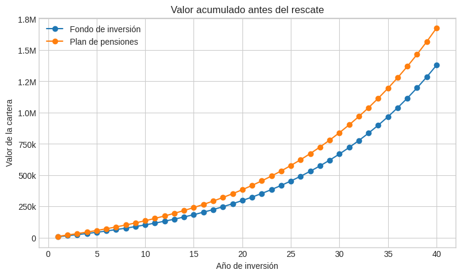

2. Rescate total
----------------

Ya tenemos el valor acumulado. Ahora hacemos la prueba más bruta:
liquidar toda la cartera en un único año y comparar cuánto dinero neto
queda después de impuestos.

.. raw:: html

    

    
    <table border="1" class="dataframe">
      <thead>
        <tr style="text-align: right;">
          <th></th>
          <th>Vehículo</th>
          <th>Aportación bruta acumulada</th>
          <th>Valor antes del rescate</th>
          <th>Rescate bruto</th>
          <th>Impuestos del rescate</th>
          <th>Comisiones de salida</th>
          <th>Dinero neto final</th>
          <th>CAGR neto efectivo</th>
        </tr>
      </thead>
      <tbody>
        <tr>
          <th>0</th>
          <td>Fondo de inversión</td>
          <td>400,000.00</td>
          <td>1,378,364.87</td>
          <td>1,378,364.87</td>
          <td>311,073.77</td>
          <td>0.00</td>
          <td>1,067,291.09</td>
          <td>0.02</td>
        </tr>
        <tr>
          <th>1</th>
          <td>Plan de pensiones</td>
          <td>400,000.00</td>
          <td>1,675,620.64</td>
          <td>1,675,620.64</td>
          <td>748,129.35</td>
          <td>0.00</td>
          <td>927,491.28</td>
          <td>0.02</td>
        </tr>
      </tbody>
    </table>
    

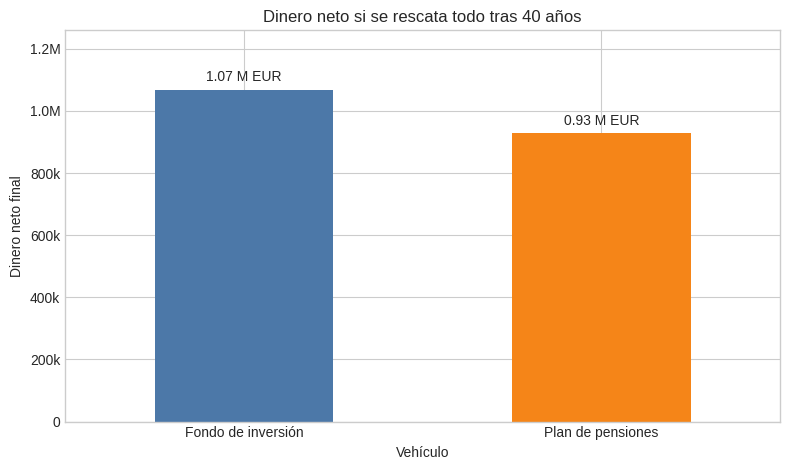

A primera vista, el plan parecía ir ganando porque acumulaba más
patrimonio bruto. La sorpresa llega al pedir el dinero neto: después del
rescate, queda por detrás.

La lectura es importante para cualquiera que esté comparando vehículos
de inversión: no basta con mirar cuánto dinero hay dentro; hay que mirar
cuánto queda fuera, ya limpio de impuestos.

Ahora descomponemos el rescate bruto para ver qué parte acaba como
dinero disponible y qué parte se la lleva Hacienda.

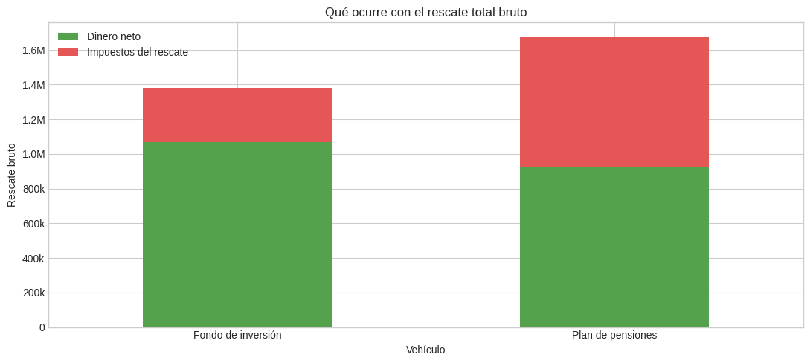

La diferencia aparece en el bloque de impuestos. El plan paga IRPF por
todo el rescate, porque ese dinero sale como renta del trabajo. El fondo
paga solo por la ganancia patrimonial, no por recuperar el capital que
ya tributó antes de invertirse.

Primera regla práctica: rescatar un plan de pensiones entero de golpe
suele ser fiscalmente agresivo. Puede haber casos concretos donde tenga
sentido, pero no es el uso natural del producto.

3. Rescates parciales
---------------------

Rescatarlo todo concentra demasiada renta en un solo ejercicio. Probemos
una estrategia más razonable: extraer cada año un porcentaje pequeño del
valor de la cartera. Extraeremos un 4%.

.. raw:: html

    

    
    <table border="1" class="dataframe">
      <thead>
        <tr style="text-align: right;">
          <th></th>
          <th>Vehículo</th>
          <th>Aportación bruta acumulada</th>
          <th>Valor antes del rescate</th>
          <th>Porcentaje rescatado</th>
          <th>Rescate bruto</th>
          <th>Impuestos del rescate</th>
          <th>Comisiones de salida</th>
          <th>Dinero neto recibido</th>
          <th>Tipo efectivo</th>
        </tr>
      </thead>
      <tbody>
        <tr>
          <th>0</th>
          <td>Fondo de inversión</td>
          <td>400,000.00</td>
          <td>1,378,364.87</td>
          <td>0.04</td>
          <td>55,134.59</td>
          <td>10,606.33</td>
          <td>0.00</td>
          <td>44,528.26</td>
          <td>0.19</td>
        </tr>
        <tr>
          <th>1</th>
          <td>Plan de pensiones</td>
          <td>400,000.00</td>
          <td>1,675,620.64</td>
          <td>0.04</td>
          <td>67,024.83</td>
          <td>27,980.74</td>
          <td>0.00</td>
          <td>39,044.08</td>
          <td>0.42</td>
        </tr>
      </tbody>
    </table>
    

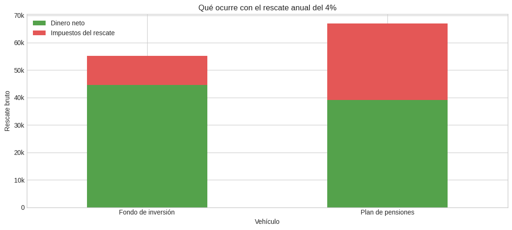

Con un ``4%``, el rescate deja de ser una bomba fiscal de un solo año.
Aun así, la pensión máxima de ``47k`` ya ocupa una parte relevante de
los tramos de IRPF, y el rescate del plan se coloca encima de esa
pensión.

El fondo sigue compitiendo bien porque tributa solo por plusvalías. El
punto clave no es solo cuánto rescatas, sino desde qué nivel de ingresos
empieza a tributar ese rescate.

4. Salario al aportar y pensión al rescatar
-------------------------------------------

El siguiente paso es mover dos variables a la vez:

- **Salario durante los años de aportación**: aproxima el tipo marginal
  que se evita al meter dinero en el plan.
- **Pensión pública o ingresos ya cobrados durante el rescate**:
  aproximan desde qué tramo empieza a tributar el dinero que sale del
  plan.

La lectura de los mapas es directa: ``60k`` o más representa una renta
alta, ``150k`` representa una renta muy alta y ``47k`` representa una
pensión máxima dentro del modelo. En los mapas, el verde significa que
el plan deja más dinero neto que el fondo; el rojo significa que gana el
fondo. La línea azul marca la frontera donde cambia el ganador.

.. raw:: html

    

    
    <table border="1" class="dataframe">
      <thead>
        <tr style="text-align: right;">
          <th></th>
          <th>Escenario</th>
          <th>Aportación anual</th>
          <th>Horizonte</th>
          <th>Comisión plan</th>
          <th>Salario mínimo</th>
          <th>Salario máximo</th>
          <th>Pensión pública / ingresos mínimos</th>
          <th>Pensión pública / ingresos máximos</th>
        </tr>
      </thead>
      <tbody>
        <tr>
          <th>0</th>
          <td>Plan de pensiones personal</td>
          <td>1,500.00</td>
          <td>40</td>
          <td>0.00</td>
          <td>1,000.00</td>
          <td>150,000.00</td>
          <td>1,000.00</td>
          <td>75,000.00</td>
        </tr>
        <tr>
          <th>1</th>
          <td>Plan de pensiones de empresa</td>
          <td>8,500.00</td>
          <td>40</td>
          <td>0.01</td>
          <td>1,000.00</td>
          <td>200,000.00</td>
          <td>1,000.00</td>
          <td>100,000.00</td>
        </tr>
      </tbody>
    </table>
    

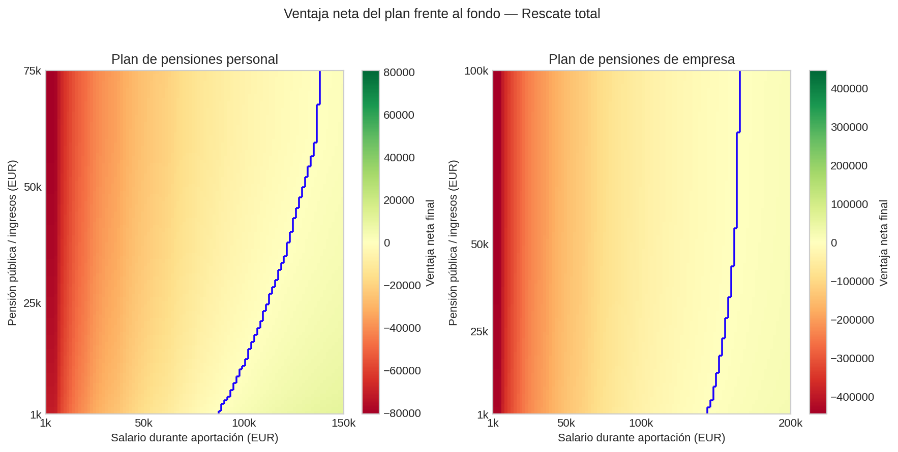

En rescate total, el plan lo tiene difícil. Al concentrar décadas de
ahorro en un solo año, el IRPF de salida domina incluso cuando la
aportación se hizo desde salarios altos.

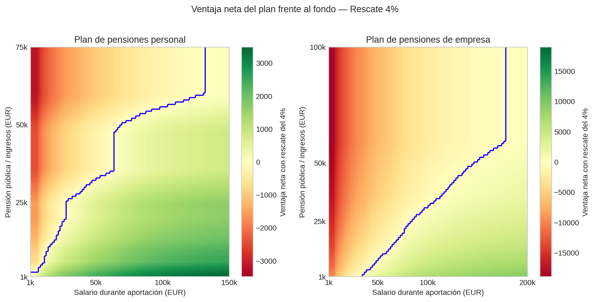

Con rescates del ``4%``, empiezan a aparecer más zonas donde el plan
puede competir. La mejora viene de repartir el IRPF de salida en
importes más pequeños y menos explosivos.

5. Comisión del plan y rentabilidad esperada
--------------------------------------------

Hasta ahora hemos usado una rentabilidad base del ``6,8%``. En esta
sección dejamos que el modelo respire un poco: movemos la rentabilidad
esperada entre ``5%`` y ``9%``, alrededor de tres referencias (``5,1%``,
``6,8%`` y ``8,5%``).

La pregunta es si el dinero extra que entra en el plan antes de IRPF
crece lo suficiente como para compensar la tributación de salida y las
comisiones adicionales.

Primero miramos el caso de salario ``60k`` y pensión máxima de ``47k``.

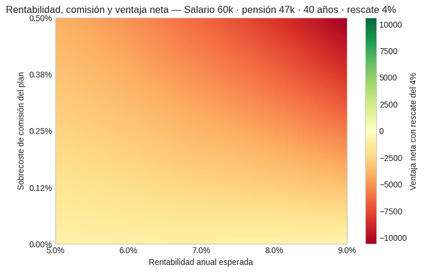

Con pensión máxima, el plan no encuentra espacio. La ventaja de aportar
antes de IRPF se enfrenta a una salida que ya empieza desde una pensión
alta.

Ahora subimos el salario a ``150k``. Este perfil ya ha saturado la base
de cotización mucho antes, pero sigue pudiendo aportar al plan desde
tramos altos de IRPF.

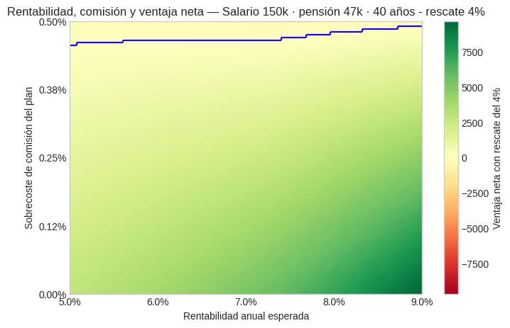

Aquí sí aparecen zonas verdes. Eso no significa que las comisiones dejen
de importar: muchas ventajas son estrechas y dependen de una
rentabilidad suficientemente alta. Sin embargo, la combinación de alta
rentabilidad esperada y extremadamente bajas comisiones es una opción
casi inexistente en planes de pensiones.

El último bloque usa un escenario de retirada temprana con pensión
pública aproximada de ``18,5k``.

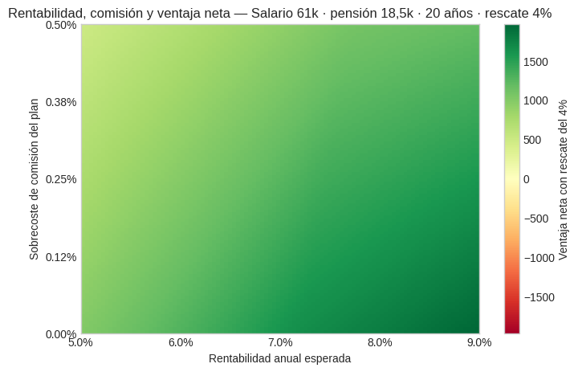

Con una pensión pública menor, el plan empieza a tener más margen. La
explicación no es que el plan sea universalmente superior, sino que el
rescate se suma sobre una base de ingresos más baja.

6. Tres casos concretos de extracción
-------------------------------------

Para cerrar, miramos tres fotos concretas. Los mapas anteriores ayudan a
ver la frontera general; estos casos sirven para aterrizar la intuición.

Primer caso: salario ``150k``, pensión máxima de ``47k`` y ``40 años``
de aportación. La pensión está capada, pero el ahorro fiscal al aportar
ocurre en tramos altos.

.. raw:: html

    

    
    <table border="1" class="dataframe">
      <thead>
        <tr style="text-align: right;">
          <th></th>
          <th>Vehículo</th>
          <th>Aportación bruta acumulada</th>
          <th>Valor antes del rescate</th>
          <th>Porcentaje rescatado</th>
          <th>Rescate bruto</th>
          <th>Impuestos del rescate</th>
          <th>Comisiones de salida</th>
          <th>Dinero neto recibido</th>
          <th>Tipo efectivo</th>
        </tr>
      </thead>
      <tbody>
        <tr>
          <th>0</th>
          <td>Fondo de inversión</td>
          <td>400,000.00</td>
          <td>1,192,253.70</td>
          <td>0.04</td>
          <td>47,690.15</td>
          <td>9,141.01</td>
          <td>0.00</td>
          <td>38,549.14</td>
          <td>0.19</td>
        </tr>
        <tr>
          <th>1</th>
          <td>Plan de pensiones</td>
          <td>400,000.00</td>
          <td>1,675,620.64</td>
          <td>0.04</td>
          <td>67,024.83</td>
          <td>27,980.74</td>
          <td>0.00</td>
          <td>39,044.08</td>
          <td>0.42</td>
        </tr>
      </tbody>
    </table>
    

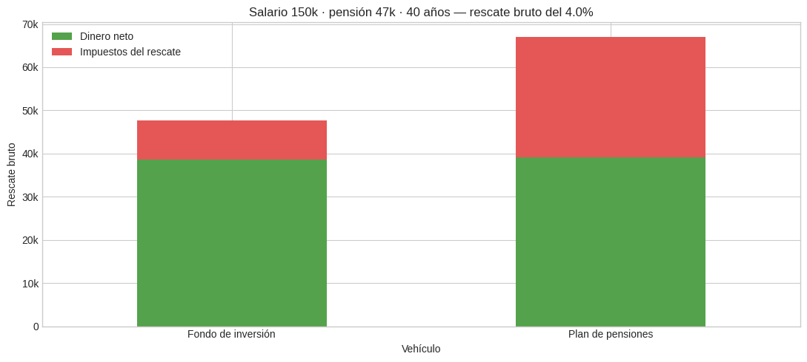

Este caso muestra por qué el plan puede empezar a tener sentido para
rentas muy altas. La pensión pública no sube indefinidamente con el
salario, pero el ahorro fiscal al aportar sí puede producirse en tramos
altos.

Aun así, la ventaja no es automática. Puede ser pequeña y depende mucho
de la comisión del plan y de la rentabilidad esperada.

Una lectura diferente algo cínica: si el resultado neto queda parecido,
el plan también puede verse como una forma de trasladar impuestos desde
la España de hoy a la España del futuro. Hacienda cobrará, pero quizá
dentro de 40 años.

Segundo caso: retirada cerca de los 50 tras ``20 años`` trabajando
alrededor de ``60k``. Todavía no hay pensión pública, así que se modela
un rescate anual medio del ``6,8%`` del plan. Las gallinas que entran
por las que salen.

.. raw:: html

    

    
    <table border="1" class="dataframe">
      <thead>
        <tr style="text-align: right;">
          <th></th>
          <th>Vehículo</th>
          <th>Aportación bruta acumulada</th>
          <th>Valor antes del rescate</th>
          <th>Porcentaje rescatado</th>
          <th>Rescate bruto</th>
          <th>Impuestos del rescate</th>
          <th>Comisiones de salida</th>
          <th>Dinero neto recibido</th>
          <th>Tipo efectivo</th>
        </tr>
      </thead>
      <tbody>
        <tr>
          <th>0</th>
          <td>Fondo de inversión</td>
          <td>200,000.00</td>
          <td>295,951.94</td>
          <td>0.07</td>
          <td>20,124.73</td>
          <td>2,946.64</td>
          <td>0.00</td>
          <td>17,178.09</td>
          <td>0.15</td>
        </tr>
        <tr>
          <th>1</th>
          <td>Plan de pensiones</td>
          <td>200,000.00</td>
          <td>383,318.06</td>
          <td>0.07</td>
          <td>26,065.63</td>
          <td>4,602.36</td>
          <td>0.00</td>
          <td>21,463.26</td>
          <td>0.18</td>
        </tr>
      </tbody>
    </table>
    

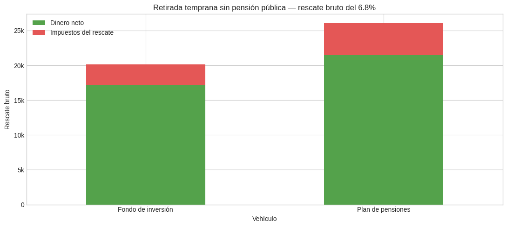

Sin pensión pública ocupando tramos de IRPF, el rescate del plan entra
desde niveles más bajos. Esta es una de las situaciones donde el
diferimiento fiscal encaja mejor, llegando a recibir más de 4000 euros
extra al año.

Tercer caso: después de esos años sin pensión, empieza una pensión
pública aproximada de ``18,5k``. El rescate baja al ``4%``, con la idea
de no forzar tanto el agotamiento de la cartera.

.. raw:: html

    

    
    <table border="1" class="dataframe">
      <thead>
        <tr style="text-align: right;">
          <th></th>
          <th>Vehículo</th>
          <th>Aportación bruta acumulada</th>
          <th>Valor antes del rescate</th>
          <th>Porcentaje rescatado</th>
          <th>Rescate bruto</th>
          <th>Impuestos del rescate</th>
          <th>Comisiones de salida</th>
          <th>Dinero neto recibido</th>
          <th>Tipo efectivo</th>
        </tr>
      </thead>
      <tbody>
        <tr>
          <th>0</th>
          <td>Fondo de inversión</td>
          <td>200,000.00</td>
          <td>295,951.94</td>
          <td>0.04</td>
          <td>11,838.08</td>
          <td>1,683.91</td>
          <td>0.00</td>
          <td>10,154.17</td>
          <td>0.14</td>
        </tr>
        <tr>
          <th>1</th>
          <td>Plan de pensiones</td>
          <td>200,000.00</td>
          <td>383,318.06</td>
          <td>0.04</td>
          <td>15,332.72</td>
          <td>4,200.90</td>
          <td>0.00</td>
          <td>11,131.82</td>
          <td>0.27</td>
        </tr>
      </tbody>
    </table>
    

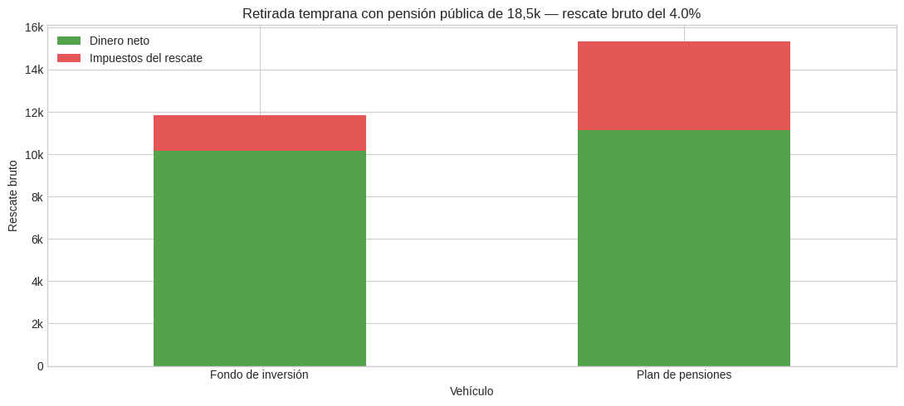

Con ``18,5k`` de pensión, el plan sigue teniendo más margen que con
pensión máxima, pero parte de los tramos ya están ocupados. La ventaja
no desaparece necesariamente, aunque se estrecha, siendo inferior a 1000
euros al año.

Podrás disfrutar de un par de fines de semana de vacaciones extra al
año.

Conclusiones
------------

Un plan de pensiones no elimina el IRPF: lo aplaza. Su ventaja aparece
cuando aportas en años con tipos marginales altos y rescatas en años con
ingresos más bajos, por ejemplo durante una retirada temprana, antes de
cobrar pensión pública o si esperas una pensión claramente inferior a tu
salario actual.

Si te jubilas a la edad ordinaria con una pensión pública alta o cercana
a la máxima, el plan casi nunca parece especialmente atractivo. El
rescate se suma a la pensión como renta del trabajo, por lo que puedes
acabar tributando a tipos parecidos a los que intentaste evitar al
aportar.

Frente a eso, el fondo indexado es más simple y flexible: inviertes
después de impuestos, pero al vender solo tributan las ganancias. En el
plan de pensiones, en cambio, todo lo rescatado tributa como renta del
trabajo, por lo que rescatar grandes cantidades de golpe suele ser una
mala estrategia.

La conclusión práctica no es “plan de pensiones sí” o “plan de pensiones
no”. El plan solo tiene sentido si hay una estrategia fiscal clara:
aportar cuando el IRPF es alto, rescatar cuando los ingresos son bajos,
evitar rescates masivos y vigilar que las comisiones no destruyan la
ventaja fiscal.
